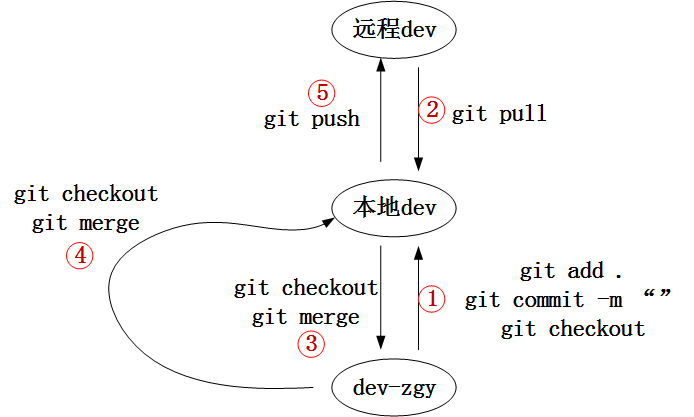
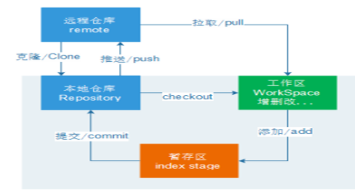
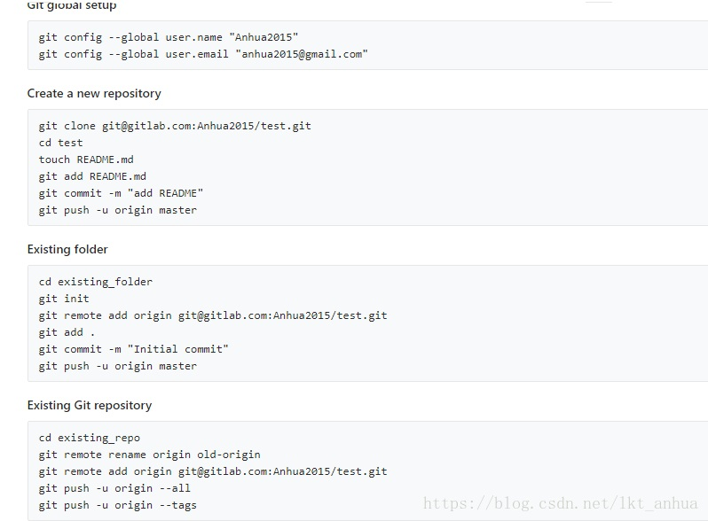

# git

## git安装


## git配置


- 测试连接
```
ssh -T git@gitee.com
```
效果图：

## git代码
1.  **关于代码**  
a、如果远端有项目，从远端clone到本地。
```
克隆远程dev分支到本地文件夹
git clone -b dev url
新建并切换分支
git checkout -b dev-yours
```  
b、如果远端没有项目，先创建空仓库，从远端clone到本地，添加文件在推到远端。  
```
先远端操作gitee创建生产/开发分支。
初始化
git init
克隆远程dev分支到本地文件夹
git clone -b dev url
新建并切换分支
git checkout -b dev-yours
添加内容后
git add .
提交
git commit -m "内容"
切换dev分支
推送到远端。
```  
c、如果一段时间后想推送到master。  
```
首先在本地dev的情况下，新建并切换分支
git checkout -b master
随后push到远端（与一般的push不一样）
git push --set-upstream origin master
```
2. **关于.gitignore**   
最好一步到位  
如果之前已经提交到远端的文件想要忽略，可以先把本地文件删除，推送到远端保证远端之前的删除。
随后修改.gitignore文件，添加此忽略内容（可以看到commit时忽不忽略两种情况内容时不一样的），下次提交时远端便没有该文件。   
```
# 忽略当前目录下的文件
.idea
# 删除当前目录以及下级所有目录中的该文件
**/resources
```

## git流程图
1. **git命令流程图**

2. **git原理流程图** 
  


## git相关平台
1. **gitee参考**  
git安装测试  
```
ssh -T git@gitee.com
```
git全局配置  
```
git config --global user.name "name"
git config --global user.email "email"
```
创建git仓库  
```
mkdir example
cd example
git init
touch README.md
git add README.md
git commit -m "first commit"
git remote add origin url
git push -u origin master
```
已有仓库  
```
cd existing_git_repo
git remote add origin url
git push -u origin master
```
2. **gitlab参考**  

* * * * * * * * * * * * * * * * 
