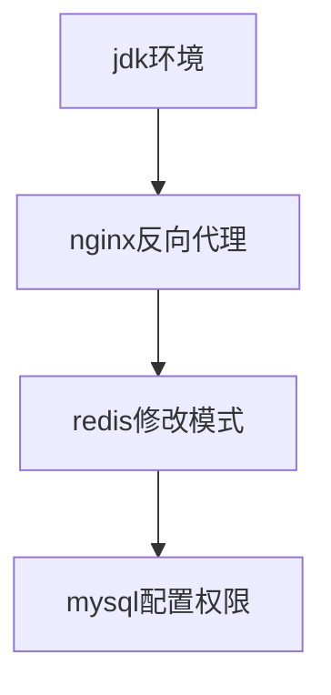
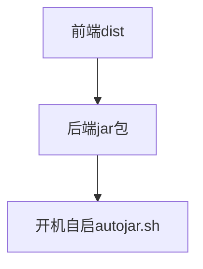

# springcloud

## 部署

> [!TIP|label:基础环境]

| 软件 | linux软件包及安装参考 | WP4镜像 | WP5镜像 | 备注 |
| :----: | :----: | :----: | :----: | :----: |
| jdk | [JDK1.8.0_271](https://mp.weixin.qq.com/s?__biz=Mzg5NTczMjA5Mw==&mid=2247483682&idx=1&sn=64962e738ff9bbe15ed74f44f4d729d2&chksm=c00a9130f77d1826a4f9f95b53c565596750503fa4db4ba4cf8f1e50ee02142a3dfc4606d10d#rd) | × | × | -- |
| nginx | [nginx1.14]() | × | √ | -- |
| redis | [redis]() | × | √ | -- |
| nacos | [nacos]() | × | × | -- |


> [!TIP|label:配置流程]




> [!TIP|label:部署流程]




> [!TIP|label:autojar.sh]

```
chmod +x /etc/init.d/autojar.sh
chmod +x /home/zgy/zgy_springcloud/shop-user-1.0-SNAPSHOT.jar
chmod +x /home/zgy/zgy_springcloud/demo-server-1.0-SNAPSHOT.jar

chkconfig --add autojar.sh

chkconfig autojar.sh on

service autojar.sh start
service autojar.sh stop
```

jar包开机自启参考
https://cloud.tencent.com/developer/article/1625609


## 后端开发日志

| 时间 | 开发节点 | 具体实现 | 备注 |
| :----: | :----: | :----: | :----: |
| -- | 数据库依赖自增id进行新增 | -- | -- |
| -- | 数据库时间字段处理 | [数据库表中字段时间自动更新](https://blog.csdn.net/qq_28334711/article/details/58717257?spm=1001.2101.3001.6650.4&utm_medium=distribute.wap_relevant.none-task-blog-2%7Edefault%7ECTRLIST%7Edefault-4.wap_blog_relevant_default&depth_1-utm_source=distribute.wap_relevant.none-task-blog-2%7Edefault%7ECTRLIST%7Edefault-4.wap_blog_relevant_default) | -- |
| -- | -- | -- | -- |

## 前端开发日志

| 时间 | 开发节点 | 具体实现 | 备注 |
| :----: | :----: | :----: | :----: |
| -- | -- | -- | -- |


## 接口文档

> [!TIP|label:本地测试postman版]    

[接口文档](https://documenter.getpostman.com/view/15075035/UVeMHNkY)，目前已不更新，转向apipost版本

> [!TIP|label:云端测试apipost版]    

见下方链接

* * * * * * * * * * * * * * * * 
