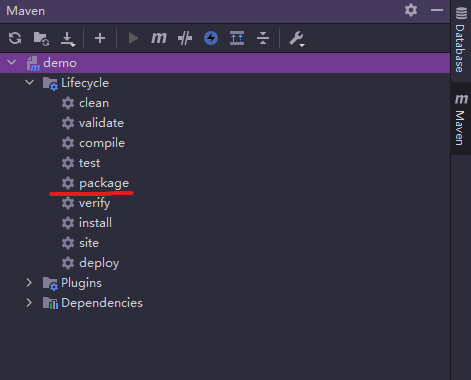

# demo后端

## 后端部署SpringBoot
1. **idea打包**  
maven工具中 Lifecycle -> package  
  
2. **启动Jar包**  
```
nohup java -jar demo.jar &
```  
开机自启设置，[参考链接](https://blog.csdn.net/zuoyixiao/article/details/103923859)  
3. **阿里云开启后端项目端口**  
4. **开发节点**  
    * 数据库依赖自增id进行新增  
    * 数据库时间字段处理  
[数据库表中字段时间自动更新](https://blog.csdn.net/qq_28334711/article/details/58717257?spm=1001.2101.3001.6650.4&utm_medium=distribute.wap_relevant.none-task-blog-2%7Edefault%7ECTRLIST%7Edefault-4.wap_blog_relevant_default&depth_1-utm_source=distribute.wap_relevant.none-task-blog-2%7Edefault%7ECTRLIST%7Edefault-4.wap_blog_relevant_default)


* * * * * * * * * * * * * * * * 
