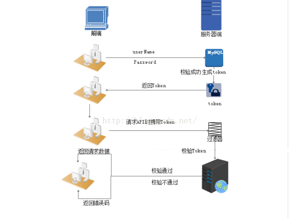
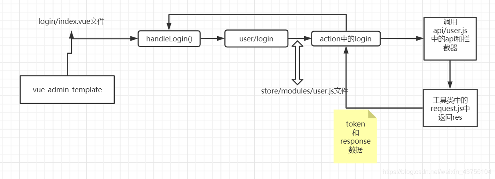

# vue

## vue
1. **token**    
  
①用户登录校验,校验成功后就返回Token给客户端。  
②客户端收到数据后保存在客户端  
③客户端每次访问API是携带Token到服务器端。  
④服务器端采用filter过滤器校验。校验成功则返回请求数据,校验失败则返回错误码  

2. **vue-admin-templete**  
运行流程

3. **相关资源**  
elementUI组件： [https://element.eleme.cn/#/zh-CN/component/installation](https://element.eleme.cn/#/zh-CN/component/installation)  

* * * * * * * * * * * * * * * * 
